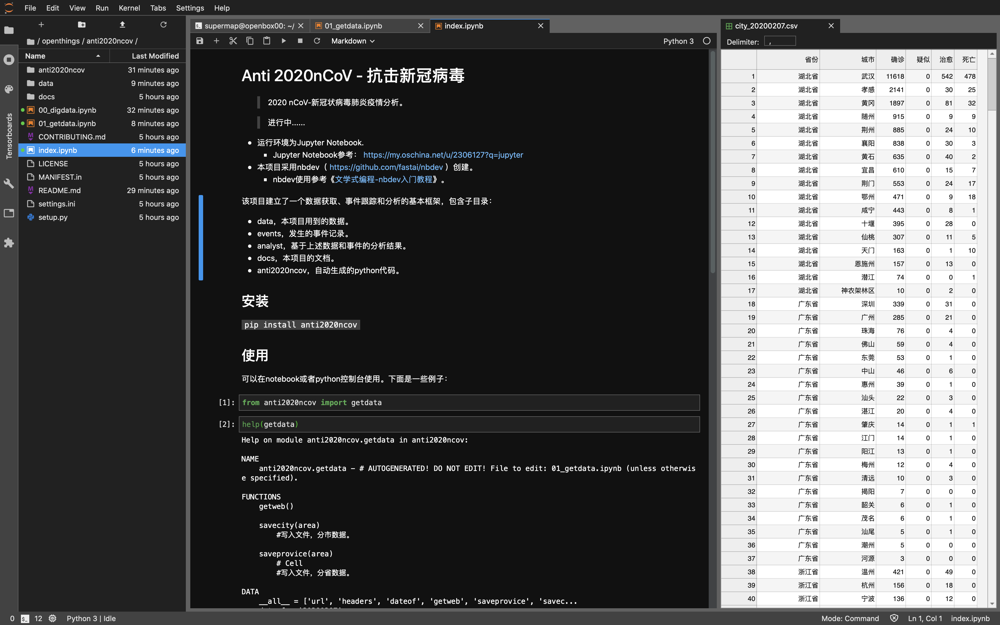
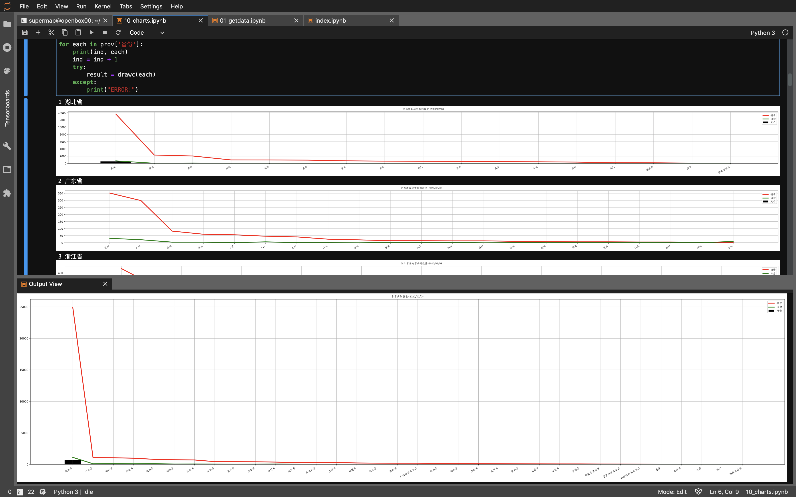

# Anti 2020nCoV - 抗击新冠病毒

```
2020 nCoV-新冠状病毒肺炎疫情分析。
进行中......
```



### 1、说明

本项目仅作为nbdev应用示范，nCoV数据及分析结论请参考专业机构发布的报告，如：
* 丁香园-新型冠状病毒肺炎疫情实时动态，https://ncov.dxy.cn/ncovh5/view/pneumonia?from=singlemessage&isappinstalled=0
* 全国卫健委-新型冠状病毒肺炎疫情防控，http://www.nhc.gov.cn/xcs/xxgzbd/gzbd_index.shtml
* 全国卫健委-官方网站，http://www.nhc.gov.cn
* 世界卫生组织（WHO），https://www.who.int/zh

### 2、运行环境
- 运行环境为Jupyter Notebook.
  - Jupyter Notebook参考： https://my.oschina.net/u/2306127?q=jupyter
- 本项目采用nbdev（ https://github.com/fastai/nbdev ）创建。
  - nbdev使用参考《[文学式编程-nbdev入门教程](https://my.oschina.net/u/2306127/blog/3163740)》。

### 3、项目结构

该项目包含子目录：

- data，本项目用到的数据。
- events，发生的事件记录。
- analyst，基于上述数据和事件的分析结果。
- docs，本项目的文档。
- anti2020ncov，自动生成的python代码。

运行情况：

